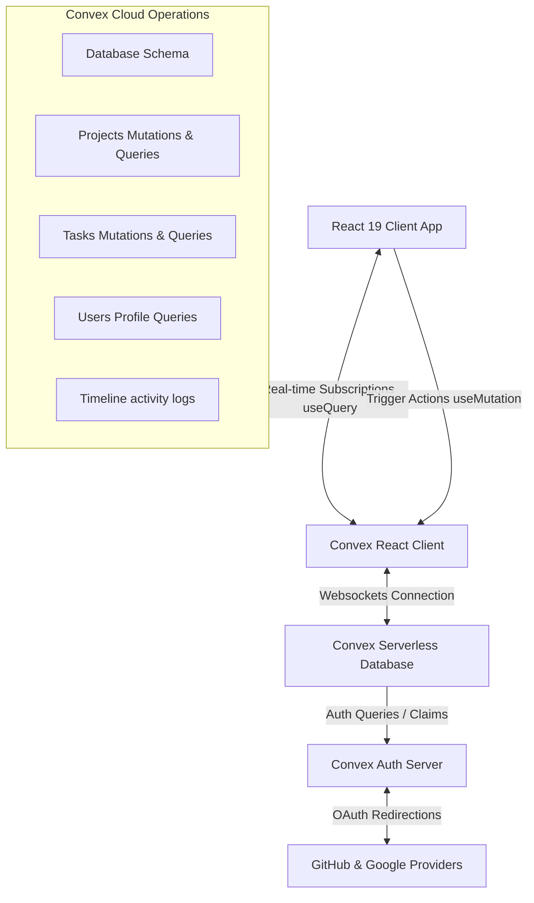

#  TeamFlow — Real-Time Project Management SaaS

TeamFlow is a production-quality, real-time Kanban project management application built using **React 19**, **Convex**, **Convex Auth**, and **Tailwind CSS**. It is designed with clean architecture, robust type safety, and real-time database subscriptions to synchronize updates instantaneously across multiple active clients.

---

##  Tech Stack

- **Frontend**: React 19 (Vite, React Router v6), Tailwind CSS v4, Lucide React (Icons), `@dnd-kit/core` (Drag and Drop), `canvas-confetti` (interactive UX rewards).
- **Backend-as-a-Service**: Convex (Real-time subscriptions, queries, mutations, indexes).
- **Authentication**: Convex Auth (First-party native OAuth with Google & GitHub).
- **Deployment Ready**: Vercel (Frontend Hosting) & Convex Cloud (Backend Hosting).

---

##  Project Structure

```
TeamFlow/
├── .env.example              # Environment variables template
├── index.html                # HTML entry point (wave emoji favicon)
├── package.json              # Script configurations & dependency tree
├── tsconfig.json             # Root TypeScript path resolution mapping
├── vite.config.ts            # Vite config with React and Tailwind v4 plugins
├── convex/                   # Convex Backend Serverless Environment
│   ├── _generated/           # Auto-generated (or compiler placeholder) files
│   ├── schema.ts             # Convex relational schema & database indexes
│   ├── auth.ts               # Convex Auth integration providers
│   ├── users.ts              # User profile query modules
│   ├── projects.ts           # Project CRUD & task counter metrics
│   ├── tasks.ts              # Task CRUD, moves, & search indexes
│   ├── activity.ts           # Timeline event log trackers
│   └── tsconfig.json         # Server compiler options
└── src/                      # Frontend Client Application
    ├── main.tsx              # React mounting root & Client Provider shells
    ├── App.tsx               # Router configuration & authentication routing guards
    ├── index.css             # Tailwind v4 directives & glassmorphic utility rules
    ├── types/
    │   └── index.ts          # Common TypeScript interfaces
    ├── lib/
    │   └── utils.ts          # Tailwind Class merger (cn)
    ├── hooks/
    │   └── useKeyPress.ts    # Hotkey binding listener (e.g. "/" for Search)
    ├── layouts/
    │   └── AppLayout.tsx     # Shell framing the sidebar and navbar
    ├── components/
    │   ├── ui/               # Reusable UI primitives
    │   │   ├── Button.tsx    # Styled Button variations (Primary, Secondary, Danger, Ghost, Outline)
    │   │   ├── Dialog.tsx    # Scroll-locked backdrop modal dialogs
    │   │   ├── Toast.tsx     # Context-based success, info, and error notifications
    │   │   ├── Skeleton.tsx  # Dynamic pulse loading placeholders
    │   │   ├── Input.tsx     # Stylized text input controls with validation errors
    │   │   ├── Textarea.tsx  # Expandable textarea elements
    │   │   └── Select.tsx    # Custom select dropdown primitives
    │   ├── layout/
    │   │   ├── Sidebar.tsx   # Project shortcut list & Sign-out button
    │   │   └── Navbar.tsx    # Global instant search command palette & breadcrumbs
    │   ├── project/
    │   │   ├── ProjectCard.tsx   # Project details, progress bar, & options dropdown
    │   │   ├── ProjectGrid.tsx   # Skeleton loading & Empty States CTAs
    │   │   └── ProjectModals.tsx # Project creation & edit modal controllers
    │   ├── board/
    │   │   ├── KanbanBoard.tsx   # Pointer Sensors DndContext coordination
    │   │   ├── KanbanColumn.tsx  # Droppable lists (Todo, In Progress, Done)
    │   │   ├── TaskCard.tsx      # Draggable items with priority & overdue alerts
    │   │   └── TaskModals.tsx    # Task detail inspection & creation (confetti on Done)
    │   └── activity/
    │       └── ActivityFeed.tsx  # Reverse chronological timeline log updates
    └── pages/
        ├── Login.tsx         # Google & GitHub OAuth actions & SaaS marketing branding
        ├── Dashboard.tsx     # Project metrics, main project grid, & global log summary
        ├── ProjectDetail.tsx # Collapsible timeline log & Kanban board
        └── NotFound.tsx      # 404 router fallbacks
```

---

##  Architectural Overview



### Key Architectural Decisions:
1. **Atomic Activity Logs**: Every mutation that modifies the workspace data (e.g., adding a task, updating a description, moving columns) executes an atomic transaction that simultaneously creates a record in the `activity` collection. This guarantees that logs can never drift from database state.
2. **Server-Side Computations**: The project card progress values (tasks completed vs total tasks) are computed on the server side in the `projects.list` query. This avoids loading all tasks on the dashboard, reducing client-side bandwidth and CPU overhead.
3. **Optimistic and WebSocket Sync**: Convex hooks up the client state directly to the server state. The moment a mutation runs, Convex updates the local UI optimistically and broadcast updates to all listening users instantly through a single persistent WebSocket.

---

## Setup & Installation Instructions

### 1. Clone the project and install packages:
```bash
git clone <repository-url>
cd TeamFlow
npm install
```

### 2. Configure Convex:
Run the Convex development command to register a new project on your Convex Cloud account. The CLI will walk you through logging in and automatically write your configuration files:
```bash
npx convex dev
```
*Note: This command generates your backend functions and sets the `VITE_CONVEX_URL` value inside `.env.local`.*

### 3. Setup Authentication (Google & GitHub OAuth):
To enable logging in, you need to register OAuth applications on GitHub Developer Settings and Google Cloud Console.

#### Google OAuth Configuration:
1. Go to the [Google Cloud Console](https://console.cloud.google.com/).
2. Create a Project, configure OAuth consent screen, and create **OAuth client ID credentials** (Web Application).
3. Set Authorized Redirect URIs to: `https://<your-convex-deployment-name>.convex.site/api/auth/callback/google`
4. Copy the Client ID and Client Secret.

#### GitHub OAuth Configuration:
1. Go to your GitHub account **Settings > Developer Settings > OAuth Apps**.
2. Click **New OAuth App**.
3. Set the Homepage URL to your client local development server (e.g. `http://localhost:5173`).
4. Set the Authorization Callback URL to: `https://<your-convex-deployment-name>.convex.site/api/auth/callback/github`
5. Click **Register Application**, then click **Generate a new client secret**.
6. Copy the Client ID and Client Secret.

#### Save Secret Keys in Convex Dashboard:
Use the Convex CLI to set the values on your cloud environment (or configure them under settings in your online dashboard):
```bash
npx convex env set AUTH_GITHUB_ID your_github_client_id
npx convex env set AUTH_GITHUB_SECRET your_github_client_secret
npx convex env set AUTH_GOOGLE_ID your_google_client_id
npx convex env set AUTH_GOOGLE_SECRET your_google_client_secret
```

### 4. Run Locally:
Once environment keys are configured, start the local development server:
```bash
npm run dev
```
Open [http://localhost:5173](http://localhost:5173) in your browser.

---

##  Verification Plan

### Manual Test Run Checklist:
- **Authentication**: Try logging in with both GitHub and Google. Test logging out, and check that trying to access `/` or `/project/:id` without logging in redirects back to `/login`.
- **Project CRUD**: Create a project, open its card, edit the title, and delete it. Observe the real-time activity feed logs.
- **Kanban Board**: Drag task cards between columns (Todo, In Progress, Done). Notice the immediate position updates, and look for confetti effects when completing a task.
- **Global Search**: Press the `/` key from anywhere to open the command palette. Search for projects or task titles, and click a search item to navigate straight to it.
- **Real-Time Collaboration**: Open the board in a standard Chrome window and an Incognito window under different accounts. Drag a task in window 1, and watch window 2 update instantly without a page refresh!

---

##  Git Commit History Suggestions

We suggest structuring your Git history with these sequential milestones for a polished showcase repository:

1. **`feat: initialize project with React 19, Tailwind v4 and dnd-kit`**
2. **`feat: define database schemas and indexes for projects, tasks, and activity logs`**
3. **`feat: configure Convex Auth with Google and GitHub OAuth providers`**
4. **`feat: implement projects, tasks, and activity CRUD server functions`**
5. **`feat: build core UI layout components (Sidebar, Navbar, Dialog, Toasts)`**
6. **`feat: build project dashboard widgets and grid system`**
7. **`feat: implement Kanban board and task detail modals with drag-and-drop`**
8. **`feat: implement timeline activity logger and global instant search`**
9. **`docs: complete architecture specifications and installation guide`**

---

##  Future Improvements

1. **Project Invitation Links**: Allow owners to generate unique links to invite external users directly into their project boards.
2. **Real-time Cursor Tracking**: Render live collaborative mouse cursors of other active members on the Kanban board using Convex presence trackers.
3. **Task Sub-checklists**: Support breaking down tasks into smaller sub-task checkboxes with individual completions.
4. **Dark/Light Theme Toggle**: Expand CSS theme system to support toggleable light configurations.
